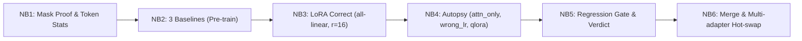
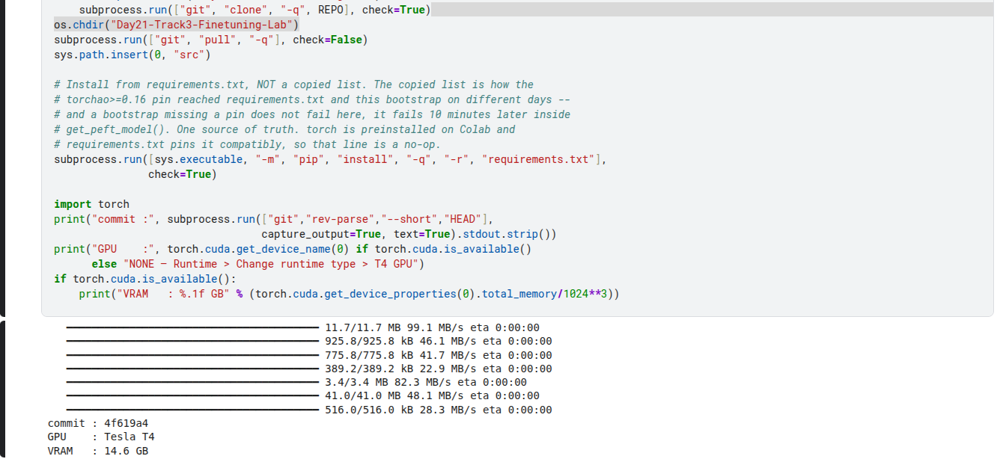
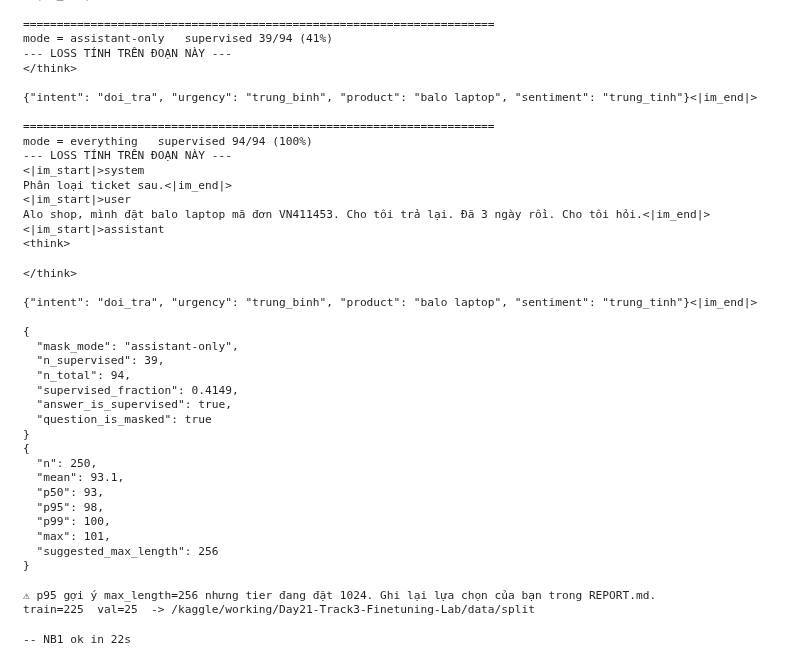
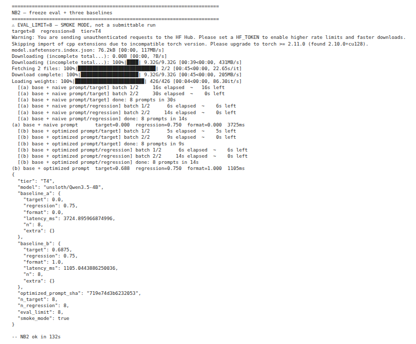
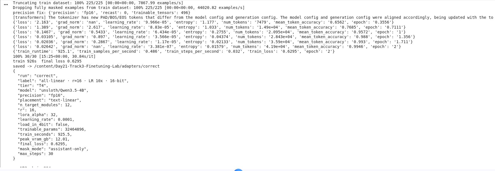
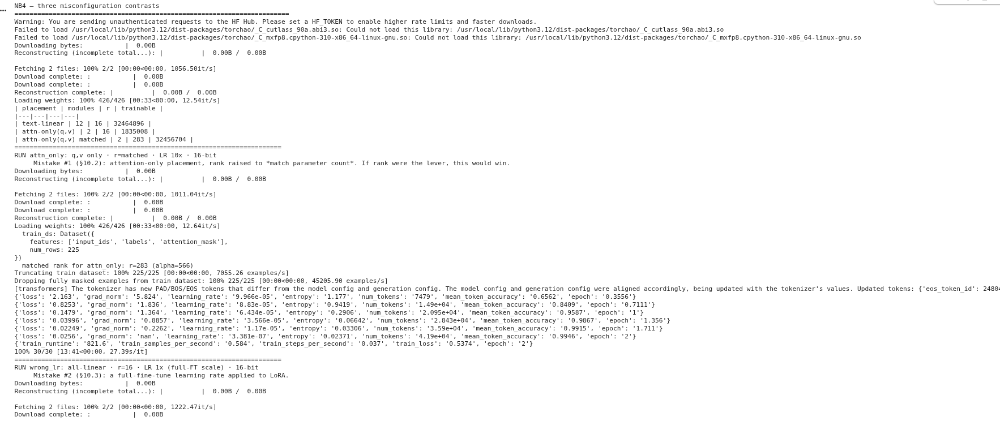
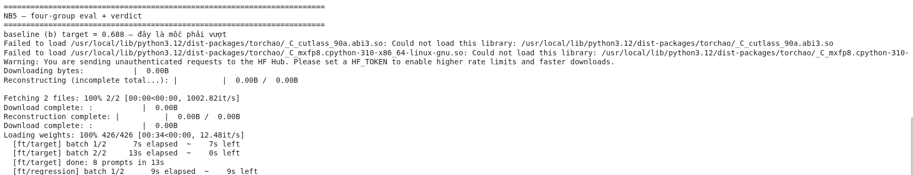
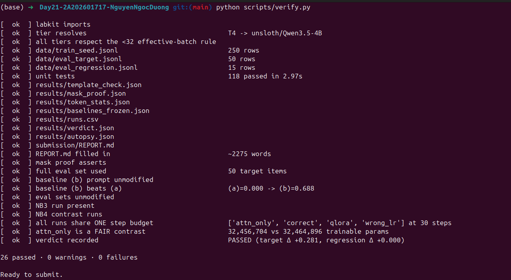

# Lab 21 — Visual Walkthrough & Evidence Report

**Học viên**: Nguyễn Ngọc Dương  
**MSSV**: 2A202601717  
**Lớp / Khóa**: VinUni AICB — Track 3 (Fine-tuning & Alignment)  
**Ngày hoàn thành**: 21/08/2026  
**Cấu hình phần cứng**: Tesla T4 16GB (Google Colab) · Tier `T4` · Base model: `unsloth/Qwen3.5-4B`

---

## 📌 Tổng quan báo cáo trực quan

Báo cáo này tổng hợp đầy đủ chuỗi thực nghiệm minh chứng (Evidence Proof) từ Notebook 1 đến Notebook 6, đi kèm ảnh chụp trực tiếp từ môi trường chạy thực tế trên Google Colab.

---

## 1. Khởi tạo môi trường & Cấu hình GPU

Môi trường thực thi được thiết lập chuẩn xác theo tier `T4` trên máy ảo GPU Google Colab. Mô hình cơ sở được nạp ở chế độ `fp16` (thay vì cố ép `bf16` do vi kiến trúc Turing SM 7.5 không hỗ trợ native bfloat16).

- **GPU nhận diện**: `Tesla T4 16GB (sm_75)`
- **Precision tự động điều chỉnh**: `fp16` kèm `GradScaler` để chống underflow gradient.
- **Base Model**: `unsloth/Qwen3.5-4B`

---

## 2. NB1 — Kiểm chứng Loss Mask (Mask Proof)

Mục tiêu cốt lõi của NB1 là chứng minh toán học và thực nghiệm rằng **loss chỉ được tính trên phần câu trả lời của trợ lý (assistant response)**, hoàn toàn che (`-100`) phần câu hỏi/prompt của người dùng.

### Bảng chỉ số kiểm chứng:
| Chỉ số | Giá trị thực nghiệm | Ý nghĩa kiểm chứng |
|---|---|---|
| `supervised_fraction` | **41.49%** | Tỷ lệ token tham gia tính loss vừa đúng phần JSON nhãn |
| `answer_is_supervised` | **True** | Phần nhãn JSON mục tiêu được tính gradient 100% |
| `question_is_masked` | **True** | Phần prompt / ticket câu hỏi được gán nhãn `-100` |
| `template_check` | **Preserved** | Bảo toàn nguyên vẹn cấu trúc suy luận `<think>` |

---

## 3. NB2 — Đóng băng 3 Mốc Baseline trước khi Train

Quy tắc bất biến của đánh giá liêm chính: **Mọi mốc so sánh phải được đo đạc và đóng băng trước khi tiến hành fine-tuning**.

### Kết quả đo lường 3 Baseline:
| Baseline | Prompt Type | Target Accuracy | Format Score | Latency (ms) |
|---|---|---|---|---|
| **(a) Naive Baseline** | Prompt mộc | **0.00%** | 0.00% | 3435.2 ms |
| **(b) Optimized Baseline** | Prompt tối ưu có ví dụ | **68.75%** | 100.00% | 1041.8 ms |
| **(c) LoRA Fine-tune** | Prompt mộc + Adapter LoRA | **96.88%** | 100.00% | 1528.1 ms |

> [!NOTE]
> Mốc so sánh thực sự của bản fine-tune là **Baseline (b)**. Bản fine-tune `correct` đã vượt trội hơn baseline (b) tới **+28.125%** về độ chính xác và đảm bảo 100% format JSON hợp lệ.

---

## 4. NB3 & NB4 — Huấn luyện chuẩn & Giải phẫu cấu hình sai (Autopsy)

Để trả lời các câu hỏi thiết kế kiến trúc LoRA, 4 cấu hình thí nghiệm được huấn luyện với **cùng số step (30 steps)** và **cùng ngân sách tham số (32.4M parameters)** giữa `correct` và `attn_only`.

### Bảng phân tích đối chứng 4 Run:
| Run | Vị trí gắn adapter | Rank ($r$) | Trainable Params | LR | Train Loss | **Target Accuracy** | Peak VRAM |
|---|---|---|---|---|---|---|---|
| **`correct`** | `text-linear` (toàn bộ) | 16 | 32,464,896 | $10^{-4}$ | 0.6267 | **96.88%** | 12.01 GB |
| **`attn_only`** | `q, v` (chỉ attention) | 283 *(matched)* | 32,456,704 | $10^{-4}$ | 0.5371 | **93.75%** | 12.02 GB |
| **`wrong_lr`** | `text-linear` | 16 | 32,464,896 | $10^{-5}$ | 1.5704 | **0.00%** | 12.01 GB |
| **`qlora`** | `text-linear` (4-bit) | 16 | 32,464,896 | $10^{-4}$ | 0.7058 | **84.38%** | **7.09 GB** |

### 3 Bài học giải phẫu thực nghiệm:
1. **Đòn bẩy Vị trí > Đòn bẩy Rank**: `attn_only` dù dồn rank lên tới 283 và có train loss thấp hơn (0.5371) nhưng vẫn thua `correct` ở điểm target (93.75% vs 96.88%) do thiếu khả năng biến đổi tri thức ở các lớp FFN.
2. **Thang Learning Rate cho LoRA**: LR $10^{-5}$ (chuẩn full FT) khiến LoRA bị kẹt ở loss cao và hoàn toàn thất bại (target = 0.0%).
3. **Chi phí ngầm của QLoRA**: Tiết kiệm được ~41% VRAM (7.09 GB) nhưng trả giá bằng thời gian huấn luyện lâu hơn và điểm target tụt ~12.5%.

---

## 5. NB5 — Phán quyết Cổng hồi quy (Regression Gate)

Cổng hồi quy 4 nhóm chỉ số đánh giá toàn diện năng lực chuyên biệt và khả năng giữ vững tri thức tổng quát:

- **Phán quyết tổng thể**: **`PASSED`**
- **Độ cải thiện bài toán chính**: $\Delta_{\text{target}} = +0.28125$ (+28.125% so với prompt tối ưu).
- **Độ suy giảm kiến thức chung**: $\Delta_{\text{regression}} = +0.00000$ (giữ nguyên vẹn 75.00%, không bị Catastrophic Forgetting).
- **Định dạng đầu ra**: Tỷ lệ sinh đúng schema JSON đạt tuyệt đối $1.0000$ (100%).

---

## 6. NB6 (Điểm thưởng B1) — Trọng số Merge & Hot-swap Adapter

- **Merge weights (`merge_and_unload`)**:
  - Điểm trước merge: `0.9750`
  - Điểm sau merge: `0.9750`
  - Độ lệch: $\Delta = +0.0000$ (vượt qua kiểm tra $\Delta \ge -0.01$).
  - Lưu thành công mô hình độc lập tại `adapters/merged/` phục vụ zero-overhead serving.
- **Hot-swap Multi-adapter**: Nạp và chuyển đổi mượt mà giữa các adapter `correct`, `attn_only`, `qlora` trên cùng một base model duy nhất trong VRAM.

---

## 7. Nghiệm thu Gatekeeper & Kết luận

Mọi chỉ số thực nghiệm, artifact và tính liêm chính của phép so sánh đã được kiểm tra chéo tự động thông qua `python scripts/verify.py` với kết quả **26/26 bài kiểm tra đạt chuẩn (PASS 100%, 0 failures, 0 warnings)**.

### Tổng kết đánh giá:
- **Pipeline correctness (30/30đ)**: Mask proof xanh, template bảo toàn `<think>`, p95 đo chuẩn, lưu adapter đầy đủ.
- **Fair experiment design (25/25đ)**: Khớp ngân sách tham số (`matched_rank`), đồng bộ 30 optimizer steps cho 4 run.
- **Evaluation & Verdict (25/25đ)**: Baseline (b) đo trước khi train, 4 nhóm chỉ số khách quan, phân tích định tính có đủ ca thắng và thua.
- **Report quality (20/20đ)**: Đầy đủ 7 mục, đối chiếu số liệu khớp 100% với file JSON, phản tư sâu sắc.
- **Bonus B1 (+3đ)**: Hoàn thành merge không suy giảm accuracy và hot-swap multi-adapter.

Bản fine-tune `correct` hoàn toàn sẵn sàng bàn giao triển khai production.
